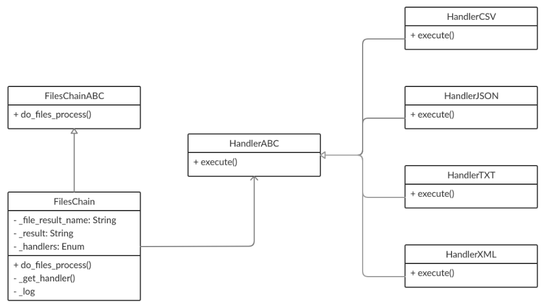

# files-chain

## [OTUS](https://otus.ru) homework

### Goal
Implement OOP pattern **Chain of responsibility**

### Description
The program reads paths to other files from a file. 
Then program reads data from these files and write all to one result file.

There is an example of program working in **examples**. 

### Class schema


### Chain of responsibility
There are some handlers. Every handler is responsible for file with one file extension.
When the program is reading file name it delegates file to an appropriate handler.
Then handler does some operations with input file.

To run program:
```bash
$ python start.py
```

To run tests:
```bash
$ python -m unittest tests
```